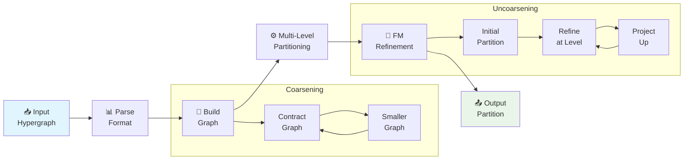
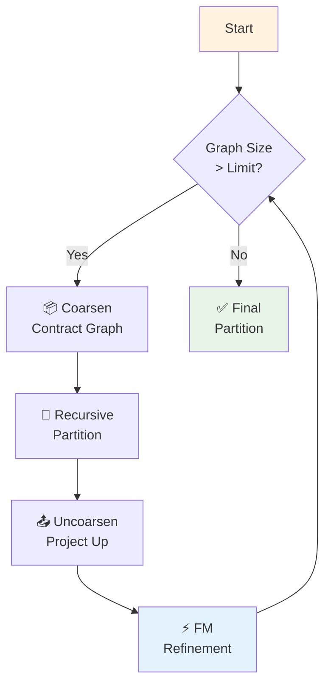

# 🔀 ckpttnpy CLI

> A hypergraph partitioner compatible with **hMetis** and **KaHyPar**, built on the ckpttnpy library.

[](https://pypi.org/project/ckpttnpy/)
[](LICENSE)

---

## 📦 Installation

```bash
# From PyPI
pip install ckpttnpy

# Or install in development mode
pip install -e .
```

---

## 🚀 Quick Start

```bash
# Binary partitioning (5% imbalance)
ckpttnpy circuit.hgr 2 5

# k-way partitioning
ckpttnpy circuit.hgr 4 10

# With verbose output
ckpttnpy circuit.hgr 2 5 -v
```

---

## 📖 Usage

```
ckpttnpy [-h] [-i {hmetis,json,dimacs}] [-f FIXED] [-o OUTPUT]
       [--output-format {hmetis,json}] [-q]
       [-p {default,quality,highest_quality,deterministic,large_k}]
       [--objective {cut,km1,soed,km1a}] [-m {direct,recursive}] [-t THREADS]
       [-s SEED] [-v] [--time-limit TIME_LIMIT] [--max-quality MAX_QUALITY]
       hypergraph_file [k] [epsilon]
```

---

### 📋 Positional Arguments

| Argument | Description | Default |
|-----------|-------------|----------|
| `hypergraph_file` | 📁 Input hypergraph file | Required |
| `k` | 🔢 Number of parts | 2 |
| `epsilon` | ⚖️ Imbalance factor (0.05 = 5%) | 0.05 |

---

### 📥 Input Options

| Option | Description |
|--------|-------------|
| `-i`, `--input-format` | 📋 Input format: hmetis, json, dimacs |
| `-f`, `--fixed` | 📌 File with pre-assigned vertices (hMetis fix file) |

---

### 📤 Output Options

| Option | Description |
|--------|-------------|
| `-o`, `--output` | 📄 Output partition file (default: stdout) |
| `--output-format` | 📋 Output format: hmetis, json |
| `-q`, `--quiet` | 🤫 Suppress output |

---

### ⚙️ Algorithm Options

| Option | Description | Choices |
|--------|-------------|---------|
| `-p`, `--preset` | 🎯 Preset configuration | default, quality, highest_quality, deterministic, large_k |
| `--objective` | 🎯 Objective function | cut, km1, soed, km1a |
| `-m`, `--mode` | 🔄 Partitioning mode | direct, recursive |
| `-t`, `--threads` | 🧵 Number of threads | 1 |

---

### 🛠️ Other Options

| Option | Description |
|--------|-------------|
| `-s`, `--seed` | 🎲 Random seed |
| `-v`, `--verbose` | 📝 Verbose output |
| `--time-limit` | ⏱️ Time limit in seconds |
| `--max-quality` | 🔝 Maximum quality (iterations) |

---

## 📊 Input Formats

### 1️⃣ hMetis Format (`.hgr`)

```
num_nets num_vertices [fmt]
v1 v2 v3 ...     # net 0
v1 v2 ...        # net 1
...
[weights]        # optional vertex weights (fmt=10 or 11)
```

**Format Codes:**
- 🚫 Omitted: unweighted
- 1️⃣: net weights
- 🔟: vertex weights
- 1️⃣1️⃣: both net and vertex weights

**Example:**
```
4 5
0 1 2
1 2 3
2 3 4
3 4 0 1
```

---

### 2️⃣ JSON Format (`.json`)

**Format 1 - Simple:**
```json
{"nets": [[0, 1, 2], [1, 2, 3], [2, 3, 4]]}
```

**Format 2 - KaHyPar-like:**
```json
{
  "hyperedges": [[0, 1, 2], [1, 2, 3]],
  "num_vertices": 5,
  "vertex_weights": [1, 2, 1, 2, 1]
}
```

**Format 3 - With Net Weights:**
```json
{
  "edges": [[0, 1, 2], [1, 2, 3]],
  "weights": [1, 2, 1, 2]
}
```

---

### 3️⃣ DIMACS Format (`.hgr`)

```
c Comment line
p hypre num_vertices num_nets
e v1 v2 v3 ...   # net 0
e v1 v2 ...      # net 1
```

---

## 📄 Output Formats

### hMetis Partition Format

```
0
1
0
1
0
```

One partition number per line (0-based).

### JSON Partition Format

```json
[0, 1, 0, 1, 0]
```

---

## 🎯 Presets

| Preset | Description |
|--------|-------------|
| `default` | Balance: 3%, recursive bisection |
| `quality` | Balance: 1%, direct k-way |
| `highest_quality` | Balance: 0.5%, direct k-way |
| `deterministic` | Fixed seed for reproducibility |
| `large_k` | Optimized for large k values |

---

## 🎯 Objectives

| Objective | Description |
|-----------|-------------|
| `cut` | Minimize edge cut |
| `km1` | Minimize (connectivity - 1) |
| `soed` | Sum of external degrees |
| `km1a` | Alternate connectivity metric |

---

## 🔄 Algorithm Flow



---

## 💻 Examples

### Basic Usage

```bash
# Partition into 2 parts with 5% imbalance
ckpttnpy circuit.hgr 2 5

# Partition into 4 parts with 10% imbalance
ckpttnpy circuit.hgr 4 10 -o partition.txt
```

---

### Verbose Output

```bash
ckpttnpy circuit.hgr 2 5 -v
```

Output:
```
Reading hypergraph from circuit.hgr...
Hypergraph: 1000 vertices, 500 nets
K=2, epsilon=0.05, preset=default
Running partitioning (preset: default)...
Partitioning cost: 450
Partition written to stdout
0
1
0
...
```

---

### JSON Input/Output

```bash
# JSON input
ckpttnpy circuit.json 2 5 -v

# JSON output
ckpttnpy circuit.hgr 2 5 -o partition.json --output-format json
```

---

### Preset Configurations

```bash
# High quality partitioning
ckpttnpy circuit.hgr 2 5 -p quality -v

# Deterministic (reproducible)
ckpttnpy circuit.hgr 4 3 -p deterministic -s 42 -v
```

---

### Quiet Mode

```bash
# Minimal output
ckpttnpy circuit.hgr 2 5 -q
```

Output:
```
0
1
0
1
0
```

---

## 🔗 Integration with Other Tools

### hMetis-style Output

```bash
# Creates same output format as hMetis
ckpttnpy circuit.hgr 2 5 > circuit.part.2
```

---

### KaHyPar-compatible CLI

```bash
# Similar CLI interface to KaHyPar
ckpttnpy circuit.hgr -k 4 -e 0.03 -p quality
```

---

## ⚙️ Algorithm Details

The CLI uses the **multi-level Fiduccia-Mattheyses (FM)** partitioning algorithm:



1. **Coarsening**: Contract hypergraph to smaller size
2. **Initial Partitioning**: Assign vertices to parts
3. **Uncoarsening**: Refine partition at each level
4. **FM Optimization**: Move vertices to improve cut

---

## 🚪 Exit Codes

| Code | Description |
|------|-------------|
| 0️⃣ | ✅ Success |
| 1️⃣ | ❌ Error (file not found, invalid format, etc.) |

---

## 📚 See Also

- 📦 [ckpttnpy library](https://github.com/luk036/ckpttnpy)
- 📦 [hMetis](https://github.com/KarypisLab/hMETIS)
- 📦 [KaHyPar](https://github.com/luk036/ckpttnpy)
